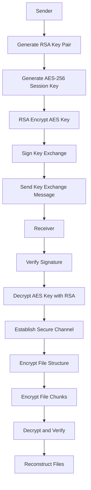

# Encrypted File Transfer Design Document

## Overview

This design implements end-to-end encrypted file transfer functionality for the lanFileSharer project, building upon the existing WebRTC signaling and connection infrastructure. The solution combines hybrid encryption (RSA + AES-256-GCM), digital signatures for authentication, and the existing `FileNode` checksum system for integrity verification. The implementation provides secure, chunked file transmission over WebRTC data channels with comprehensive progress tracking and error recovery.

## Architecture

### High-Level Encrypted Transfer Flow

1. **Key Exchange Phase**: Hybrid cryptographic key negotiation using RSA-2048 for key exchange and AES-256-GCM for data encryption
2. **Authentication Phase**: Digital signature verification of sender identity and file structure integrity
3. **Structure Encryption Phase**: File structure encrypted and transmitted using established session keys
4. **Data Encryption Phase**: Individual file chunks encrypted with AES-256-GCM and transmitted over WebRTC data channels
5. **Verification Phase**: End-to-end integrity validation using existing checksum system combined with cryptographic authentication

### Security Architecture



### Component Integration

The encrypted design integrates with existing and new components:

- `pkg/crypto/encryption.go`: **NEW** - Hybrid encryption manager with AES-256-GCM and RSA-2048
- `pkg/crypto/signature.go`: **ENHANCED** - Extended to support FileStructureManager signing
- `pkg/transfer/FileStructureManager.go`: **NEW** - Thread-safe file structure management with concurrent operations
- `pkg/transfer/protocol.go`: **ENHANCED** - Extended message types for encrypted communication
- `pkg/webrtc/connection.go`: **ENHANCED** - Implements encrypted `SendFiles()` method in `SenderConn`
- `api/receiver.go`: **ENHANCED** - Supports encrypted payload processing with key exchange
- `pkg/fileInfo/fileNode.go`: **EXISTING** - Utilizes existing `FileNode` struct and checksum functionality
- UI event system: **EXISTING** - Leverages existing progress messaging patterns

### Existing FileInfo Package Utilization

The implementation maximally reuses the existing `pkg/fileInfo` infrastructure:

#### FileNode Structure Reuse

- **Path field**: Used by sender to read file contents during transmission
- **Checksum field**: Pre-calculated by `CreateNode()`, used for integrity verification
- **Size field**: Used for progress tracking and transfer validation
- **IsDir field**: Determines file vs directory handling during reconstruction
- **Children field**: Preserves directory structure during transfer
- **MimeType field**: Maintains file type information for proper reconstruction

#### Checksum System Integration

- **`calculateSHA256()`**: Core hashing function reused for chunk-level integrity
- **`CalcChecksum()`**: Hierarchical checksum calculation for directories preserved
- **`VerifySHA256()`**: Direct integration for received file validation
- **Sorted child processing**: Existing deterministic directory checksum method maintained

## Components and Interfaces

### 1. Hybrid Encryption Component

```go
// pkg/crypto/encryption.go
type EncryptionManager struct {
    keyPair       *KeyPair
    aesKey        []byte
    gcm           cipher.AEAD
    signer        *FileStructureSigner
}

func NewEncryptionManager() (*EncryptionManager, error)
func (em *EncryptionManager) EncryptData(data []byte) ([]byte, []byte, error)  // Returns ciphertext, IV
func (em *EncryptionManager) DecryptData(ciphertext, iv []byte) ([]byte, error)
func (em *EncryptionManager) EncryptFileStructure(fsm *FileStructureManager) (*EncryptedStructurePayload, error)
func (em *EncryptionManager) CreateKeyExchange(senderID string) (*KeyExchangePayload, error)
func (em *EncryptionManager) GetEncryptedAESKey(receiverPublicKey *rsa.PublicKey) ([]byte, error)

// Key exchange structures
type KeyExchangePayload struct {
    PublicKey     []byte `json:"public_key"`
    Signature     []byte `json:"signature"`
    Timestamp     int64  `json:"timestamp"`
    SenderID      string `json:"sender_id"`
}

type EncryptedStructurePayload struct {
    EncryptedData []byte `json:"encrypted_data"`
    Signature     []byte `json:"signature"`
    IV            []byte `json:"iv"`
}
```

### 2. Enhanced Digital Signature Component

```go
// pkg/crypto/signature.go - Enhanced for FileStructureManager
type FileStructureSigner struct {
    keyPair *KeyPair
}

type SignedFileStructure struct {
    Files       []fileInfo.FileNode `json:"files"`
    PublicKey   []byte              `json:"public_key"`
    Signature   []byte              `json:"signature"`
    Directories []*fileInfo.FileNode `json:"directories,omitempty"`
    RootNodes   []*fileInfo.FileNode `json:"root_nodes,omitempty"`
    Metadata    *StructureMetadata   `json:"metadata,omitempty"`
}

// NEW: Enhanced signing for FileStructureManager
func (s *FileStructureSigner) SignFileStructureManager(fsm *FileStructureManager) (*SignedFileStructure, error)
func CreateSignedFileStructureFromManager(fsm *FileStructureManager) (*SignedFileStructure, error)
```

### 3. File Structure Management Component

```go
// pkg/transfer/FileStructureManager.go
type FileStructureManager struct {
    RootNodes []*fileInfo.FileNode
    fileMap   map[string]*fileInfo.FileNode
    dirMap    map[string]*fileInfo.FileNode
    mu        sync.RWMutex
}

func NewFileStructureManager() *FileStructureManager
func NewFileStructureManagerFromPath(path string) (*FileStructureManager, error)
func (fsm *FileStructureManager) AddFileNode(node *fileInfo.FileNode)
func (fsm *FileStructureManager) GetAllFiles() []*fileInfo.FileNode
func (fsm *FileStructureManager) GetAllDirs() []*fileInfo.FileNode
func (fsm *FileStructureManager) GetFileCount() int
func (fsm *FileStructureManager) GetTotalSize() int64
```

### 4. Enhanced Encrypted Transfer Protocol

```go
// pkg/transfer/protocol.go - Enhanced for encryption
type ChunkMessage struct {
    Type         MessageType
    Session      TransferSession
    FileID       string
    FileName     string
    SequenceNo   uint32
    Data         []byte
    ChunkHash    string
    TotalSize    int64
    ExpectedHash string
    ErrorMessage string

    // Encryption-specific fields
    IsEncrypted   bool                        `json:"is_encrypted,omitempty"`
    KeyExchange   *KeyExchangePayload         `json:"key_exchange,omitempty"`
    KeyResponse   *KeyExchangeResponsePayload `json:"key_response,omitempty"`
    EncStructure  *EncryptedStructurePayload  `json:"enc_structure,omitempty"`
    IV            []byte                      `json:"iv,omitempty"`
}

type MessageType string
const (
    // Existing message types
    ChunkData            MessageType = "chunk_data"
    FileComplete         MessageType = "file_complete"
    TransferBegin        MessageType = "transfer_begin"
    TransferComplete     MessageType = "transfer_complete"
    TransferCancel       MessageType = "transfer_cancel"
    ProgressUpdate       MessageType = "progress_update"

    // NEW: Encryption-specific message types
    KeyExchange          MessageType = "key_exchange"
    KeyExchangeResponse  MessageType = "key_exchange_response"
    EncryptedStructure   MessageType = "encrypted_structure"
    EncryptedChunk       MessageType = "encrypted_chunk"
)
```

### 5. Enhanced Encrypted WebRTC Connection

```go
// pkg/webrtc/connection.go - Enhanced for encryption
type SenderConn struct {
    *Connection
    signaler   Signaler
    serializer MessageSerializer
}

// Enhanced SendFiles with end-to-end encryption
func (c *SenderConn) SendFiles(ctx context.Context, files []fileInfo.FileNode, serviceID string) error {
    // 1. Create encryption manager with RSA key pair and AES-256 session key
    encryptionManager, err := crypto.NewEncryptionManager()

    // 2. Create FileStructureManager for efficient file management
    fsm := transfer.NewFileStructureManager()

    // 3. Execute encrypted transfer flow:
    //    - Key exchange with digital signature authentication
    //    - Encrypted file structure transmission
    //    - Encrypted chunk-by-chunk file data transmission
    //    - Encrypted transfer completion confirmation
}

// Enhanced receiver-side encrypted handler
type FileReceiver struct {
    state             ReceiverState
    session           *TransferSession
    fileStructure     *FileStructureManager
    encryptionManager *crypto.EncryptionManager
    activeFiles       map[string]*FileWriter
    baseDir           string
    mu                sync.RWMutex
}

// Encrypted file reconstruction with integrity validation
func (fr *FileReceiver) handleEncryptedChunk(msg *ChunkMessage) error {
    // 1. Decrypt chunk data using AES-256-GCM
    decryptedData, err := fr.encryptionManager.DecryptData(msg.Data, msg.IV)

    // 2. Verify decrypted data hash against expected chunk hash
    // 3. Write decrypted data to file buffer
    // 4. Validate final file integrity using existing VerifySHA256() method
}
```

### 6. Enhanced Encrypted API Payload

```go
// Enhanced AskPayload in api/receiver.go - Now supports encrypted file structures
type AskPayload struct {
    SignedFiles *crypto.SignedFileStructure `json:"signed_files"`
    Offer       webrtc.SessionDescription   `json:"offer"`

    // NEW: Encryption support
    KeyExchange *crypto.KeyExchangePayload `json:"key_exchange,omitempty"`
    IsEncrypted bool                       `json:"is_encrypted,omitempty"`
}
```

## Data Models

### Encrypted File Buffer Management

```go
type FileBuffer struct {
    FileID       string
    FileNode     fileInfo.FileNode     // Contains all metadata including Checksum, Size, MimeType
    Chunks       map[uint32][]byte     // Stores decrypted chunk data
    ReceivedSize int64
    TempFilePath string
    IsComplete   bool

    // NEW: Encryption-specific fields
    IsEncrypted     bool
    DecryptionKey   []byte
    ChunkHashes     map[uint32]string  // Hash of decrypted chunks for integrity
}

// Enhanced integrity validation with encryption support
func (fb *FileBuffer) ValidateIntegrity() error {
    if fb.IsComplete {
        // 1. Validate individual chunk hashes (decrypted data)
        for seqNo, chunkData := range fb.Chunks {
            expectedHash := fb.ChunkHashes[seqNo]
            actualHash := sha256.Sum256(chunkData)
            if hex.EncodeToString(actualHash[:]) != expectedHash {
                return fmt.Errorf("chunk %d integrity check failed", seqNo)
            }
        }

        // 2. Validate final file checksum using existing method
        tempNode := fileInfo.FileNode{
            Path:     fb.TempFilePath,
            Checksum: fb.FileNode.Checksum,
        }
        valid, err := tempNode.VerifySHA256(fb.FileNode.Checksum)
        if err != nil {
            return err
        }
        if !valid {
            return fmt.Errorf("file integrity check failed for %s", fb.FileID)
        }
    }
    return nil
}
```

### Transfer Session Management

```go
type TransferSession struct {
    ServiceID       string `json:"service_id"`
    SessionID       string `json:"session_id"`
    SessionCreateAt int64  `json:"session_create_at"`

    // NEW: Encryption session data
    IsEncrypted     bool   `json:"is_encrypted"`
    KeyExchangeID   string `json:"key_exchange_id,omitempty"`
    EncryptionAlgo  string `json:"encryption_algo,omitempty"`  // "AES-256-GCM"
}
```

### Progress Tracking

```go
type ProgressUpdate struct {
    FileID          string
    FileName        string
    BytesTransferred int64
    TotalBytes      int64
    Status          TransferStatus
}

type TransferStatus string
const (
    StatusStarted    TransferStatus = "started"
    StatusInProgress TransferStatus = "in_progress"
    StatusCompleted  TransferStatus = "completed"
    StatusFailed     TransferStatus = "failed"
    StatusCancelled  TransferStatus = "cancelled"
)
```

## Error Handling

### Cryptographic Errors

- **Key Exchange Failures**: Invalid RSA public keys, signature verification failures during key exchange
- **Encryption/Decryption Errors**: AES-256-GCM authentication failures, invalid IV/nonce values
- **Signature Verification Errors**: Invalid signature format, public key verification failure, file structure tampering detection
- **Key Management Errors**: AES key decryption failures, corrupted session keys

### Transfer Errors

- **Encrypted Chunk Transmission Failures**: Chunk encryption errors, transmission failures with exponential backoff retry
- **WebRTC Connection Drops**: Connection state monitoring with encrypted session recovery
- **File Reconstruction Errors**: Decryption failures during file reconstruction, cleanup of encrypted temporary files

### Integrity Validation Errors

- **Encrypted Data Integrity**: GCM authentication tag verification failures, corrupted encrypted chunks
- **Decrypted Data Validation**: Individual chunk hash mismatches after decryption using SHA-256
- **File Checksum Validation**: Final file checksum mismatches using existing `VerifySHA256()` method
- **Directory Structure Integrity**: Encrypted directory structure corruption detection and recovery
- **Cleanup Procedures**: Secure deletion of temporary encrypted files and session keys on validation failure

## Testing Strategy

### Unit Tests

1. **Encryption Component Tests**

   - RSA key pair generation and validation (2048-bit minimum)
   - AES-256-GCM encryption/decryption with random IV generation
   - Hybrid encryption workflow: RSA key exchange + AES data encryption
   - Key derivation and session key management
   - Edge cases with malformed encrypted data and invalid keys

2. **Enhanced Signature Component Tests**

   - FileStructureManager signing functionality with enhanced metadata
   - Signature verification with valid/invalid signatures and tampered data
   - Key exchange message signing and verification
   - Integration with encryption manager for authenticated encryption

3. **Encrypted File Transfer Protocol Tests**

   - Encrypted chunk serialization/deserialization with IV handling
   - Message ordering and sequencing with encrypted payloads
   - Encrypted buffer management and secure file reconstruction
   - Key exchange protocol message flow validation

4. **FileStructureManager Tests**
   - Thread-safe concurrent file structure operations
   - Integration with encryption for structure signing
   - Performance testing with large directory structures
   - Memory usage optimization validation

### Integration Tests

1. **End-to-End Encrypted Transfer Tests**

   - Complete encrypted file transfer workflow with key exchange
   - Multiple encrypted file transfers with session key reuse
   - Large file handling with chunked encryption (>1GB files)
   - Mixed file type transfers (binary, text, media files)

2. **Security Integration Tests**

   - Man-in-the-middle attack resistance during key exchange
   - Encrypted session hijacking prevention
   - Replay attack prevention with timestamp validation
   - Forward secrecy validation (session key rotation)

3. **Error Scenario Tests**

   - Network interruption recovery with encrypted session restoration
   - Signature verification failures during key exchange
   - Decryption failures and secure cleanup procedures
   - Corrupted encrypted chunk handling and recovery

4. **Performance Tests**
   - Encrypted transfer speed benchmarks vs. unencrypted baseline
   - Memory usage during large encrypted transfers
   - CPU overhead of encryption/decryption operations
   - Concurrent encrypted transfer handling

### Security Tests

1. **Cryptographic Security**

   - RSA key strength validation (minimum 2048-bit)
   - AES-256-GCM authenticated encryption validation
   - IV/nonce uniqueness and randomness testing
   - Key exchange protocol security analysis

2. **Data Protection**

   - Encrypted data integrity with GCM authentication tags
   - Tampered encrypted chunk detection and rejection
   - File reconstruction accuracy with decryption validation
   - Secure key material cleanup after transfer completion

3. **Authentication Security**

   - Digital signature validation for sender authentication
   - File structure integrity protection against tampering
   - Session authentication and authorization validation
   - Public key certificate validation (if implemented)

4. **Attack Resistance**
   - Chosen plaintext attack resistance
   - Timing attack mitigation in cryptographic operations
   - Side-channel attack considerations
   - Cryptographic protocol analysis against known attack vectors
