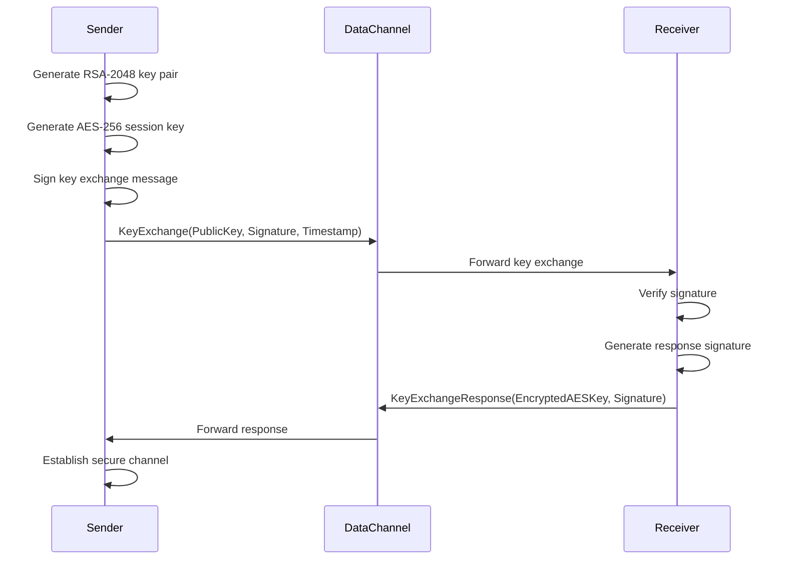
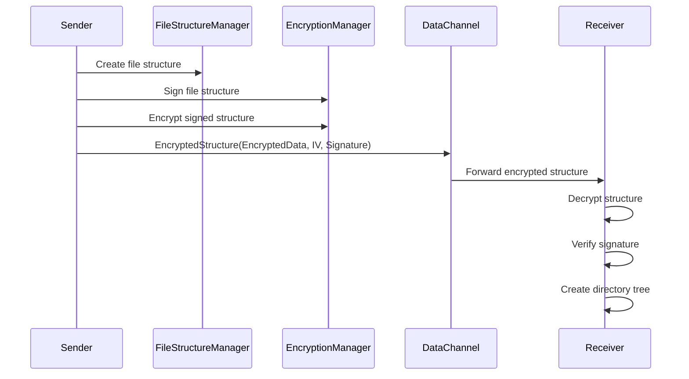
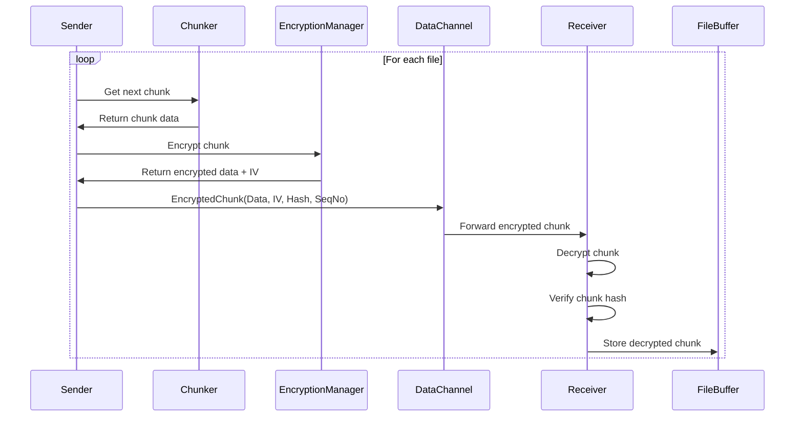
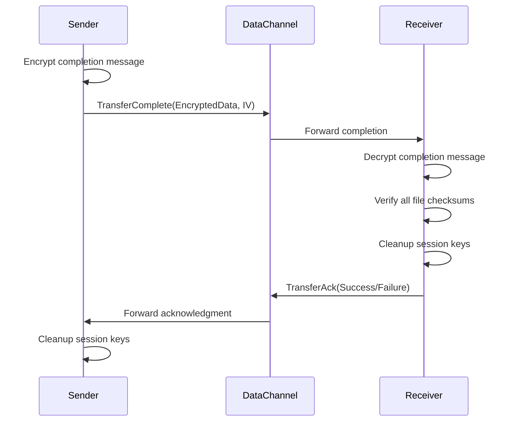

# Encrypted File Transfer Flow

## Overview

This document describes the complete end-to-end encrypted file transfer flow implemented in the lanFileSharer project. The system uses hybrid encryption combining RSA-2048 for key exchange and AES-256-GCM for data encryption, providing confidentiality, integrity, and authenticity.

## Security Architecture

### Cryptographic Components

- **RSA-2048**: Asymmetric encryption for key exchange and digital signatures
- **AES-256-GCM**: Symmetric authenticated encryption for file data
- **SHA-256**: Hash function for integrity verification and digital signatures
- **PKCS#1 v1.5**: RSA signature scheme for authentication

### Security Properties

- **Confidentiality**: All file data encrypted with AES-256-GCM
- **Integrity**: GCM authentication tags and SHA-256 checksums
- **Authenticity**: RSA digital signatures for sender verification
- **Forward Secrecy**: Unique AES session keys per transfer
- **Replay Protection**: Timestamps and session IDs

## Complete Transfer Flow

### Phase 1: Key Exchange and Authentication



**Messages:**

- `KeyExchange`: Contains RSA public key, signature, timestamp, sender ID
- `KeyExchangeResponse`: Contains RSA-encrypted AES key, receiver signature

### Phase 2: Encrypted File Structure Transmission



**Process:**

1. Sender creates `FileStructureManager` with all files and directories
2. Structure is digitally signed using RSA private key
3. Signed structure is encrypted using AES-256-GCM
4. Encrypted structure is transmitted with IV and signature
5. Receiver decrypts, verifies signature, and creates local directory structure

### Phase 3: Encrypted File Data Transmission



**Process:**

1. Sender reads file using existing `Chunker` system
2. Each chunk is encrypted with AES-256-GCM using unique IV
3. Original chunk hash is included for integrity verification
4. Receiver decrypts chunk and verifies hash before storage
5. Process repeats until all file chunks are transmitted

### Phase 4: Transfer Completion and Verification



## Message Types and Structures

### Key Exchange Messages

```go
type KeyExchangePayload struct {
    PublicKey     []byte `json:"public_key"`      // RSA-2048 public key
    Signature     []byte `json:"signature"`       // RSA signature of exchange data
    Timestamp     int64  `json:"timestamp"`       // Unix timestamp for replay protection
    SenderID      string `json:"sender_id"`       // Sender identifier
}

type KeyExchangeResponsePayload struct {
    EncryptedAESKey []byte `json:"encrypted_aes_key"` // RSA-encrypted AES-256 key
    ReceiverID      string `json:"receiver_id"`       // Receiver identifier
    Signature       []byte `json:"signature"`         // RSA signature of response
}
```

### Encrypted Structure Message

```go
type EncryptedStructurePayload struct {
    EncryptedData []byte `json:"encrypted_data"`  // AES-encrypted file structure
    Signature     []byte `json:"signature"`       // RSA signature of encrypted data
    IV            []byte `json:"iv"`              // AES-GCM initialization vector
}
```

### Encrypted Chunk Message

```go
type ChunkMessage struct {
    Type         MessageType `json:"type"`           // "encrypted_chunk"
    Session      TransferSession `json:"session"`    // Session information
    FileID       string      `json:"file_id"`        // File identifier
    FileName     string      `json:"file_name"`      // Original filename
    SequenceNo   uint32      `json:"sequence_no"`    // Chunk sequence number
    Data         []byte      `json:"data"`           // Encrypted chunk data
    ChunkHash    string      `json:"chunk_hash"`     // Hash of original (decrypted) data
    TotalSize    int64       `json:"total_size"`     // Total file size
    ExpectedHash string      `json:"expected_hash"`  // Expected file checksum
    IsEncrypted  bool        `json:"is_encrypted"`   // Encryption flag
    IV           []byte      `json:"iv"`             // AES-GCM IV for this chunk
}
```

## Error Handling

### Cryptographic Errors

- **Key Exchange Failures**: Invalid signatures, malformed keys, timestamp validation
- **Encryption Errors**: AES key generation, IV generation, encryption failures
- **Decryption Errors**: GCM authentication failures, invalid ciphertext
- **Signature Verification**: Invalid signatures, tampered data detection

### Recovery Procedures

- **Session Key Rotation**: Generate new session keys on certain failures
- **Secure Cleanup**: Immediate cleanup of cryptographic material on errors
- **Error Reporting**: Detailed error codes without exposing sensitive information
- **Fallback Mechanisms**: Graceful degradation with user notification

## Performance Considerations

### Optimization Strategies

- **Streaming Encryption**: Process files in chunks to minimize memory usage
- **Concurrent Processing**: Parallel encryption/decryption where possible
- **Key Reuse**: Single AES session key per transfer session
- **Buffer Management**: Efficient memory management for encrypted data

### Performance Metrics

- **Encryption Overhead**: Target <20% performance impact vs unencrypted
- **Memory Usage**: Bounded memory usage regardless of file size
- **CPU Utilization**: Efficient use of hardware acceleration when available
- **Network Efficiency**: Minimal protocol overhead for encryption metadata

## Security Considerations

### Threat Model

- **Passive Eavesdropping**: Mitigated by AES-256-GCM encryption
- **Active Tampering**: Mitigated by GCM authentication and RSA signatures
- **Man-in-the-Middle**: Mitigated by RSA signature verification
- **Replay Attacks**: Mitigated by timestamps and session IDs

### Security Best Practices

- **Key Management**: Secure generation, storage, and cleanup of keys
- **Random Number Generation**: Cryptographically secure randomness for keys and IVs
- **Timing Attack Mitigation**: Constant-time operations where applicable
- **Side-Channel Protection**: Secure memory handling and key cleanup

## Implementation Status

- [x] **Cryptographic Infrastructure**: RSA key generation, AES-GCM encryption
- [x] **Digital Signatures**: File structure signing and verification
- [x] **File Structure Management**: Thread-safe FileStructureManager
- [ ] **Key Exchange Protocol**: RSA-based authenticated key exchange
- [ ] **Encrypted Transfer Protocol**: AES-encrypted chunk transmission
- [ ] **Receiver Implementation**: Decryption and file reconstruction
- [ ] **Error Handling**: Comprehensive cryptographic error management
- [ ] **Performance Optimization**: Streaming encryption and memory management
- [ ] **Security Testing**: Cryptographic protocol validation and attack testing
